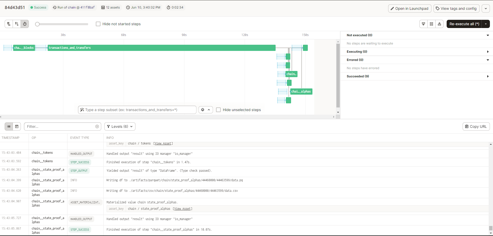
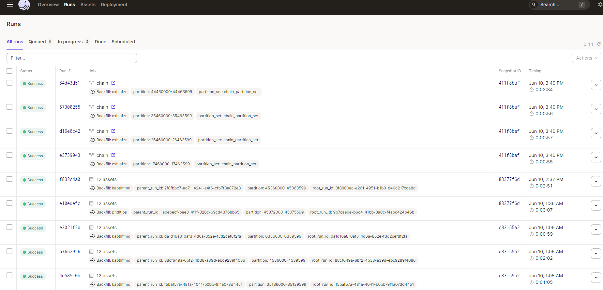
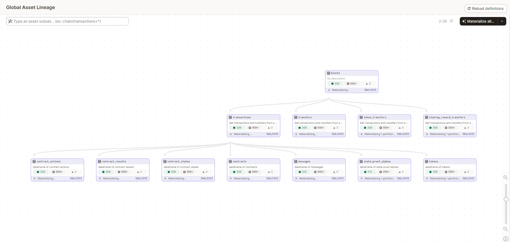
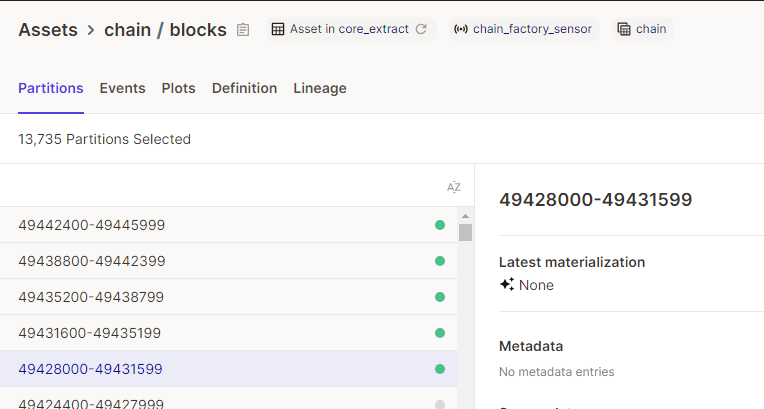
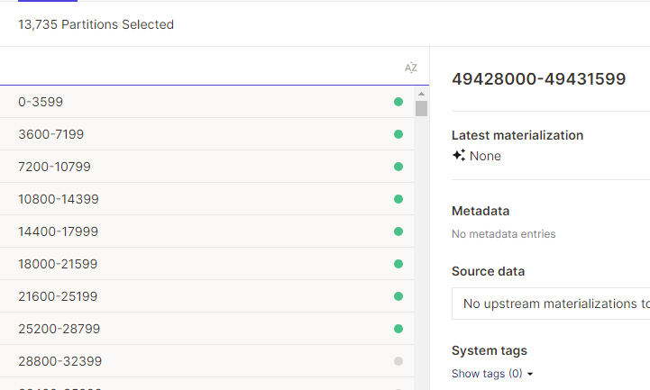

# Network states ETL for Hedera

### Node Providers

- https://mainnet-public.mirrornode.hedera.com/

### JSON-RPC API References

- https://docs.hedera.com/hedera/sdks-and-apis/rest-api

### Relevant Docs
On the Hedera network:
- Blocks: https://hips.hedera.com/hip/hip-415
- Staking Rewards: https://hips.hedera.com/hip/hip-406
- Tokens: https://docs.hedera.com/hedera/sdks-and-apis/sdks/readme-1/define-a-token
- Contracts: https://docs.hedera.com/hedera/sdks-and-apis/sdks/smart-contracts/create-a-smart-contract
- Transcation state proofs: https://hedera.com/blog/introducing-state-proof-alpha

### Please describe the steps you've taken to validate the data

- Tests cases for important assets and utility functions in `pipelines/core/extract/tests`
- Ran ~ 300 partitions, including the starting 8, the ending 5 and other random ones, and ensure their result is successful

 Run images 

### Files and directories
  - `chain.py` defines assets and constructs partitions with `NumericBlockFactory`.
  - `utils.py` defines the utility functions used across the pipeline
  - `config.py` defines the parameters used by the asset functions
  - `constants.py` records the constant filters used by asset functions
  - `sources.yml` defines the return tables

### Design decisions
#### Make `blocks` asset upstream of `transactions`, despite the latter being the primary entity in Hedera network
  - `blocks` are not a native concept in Hedera (see HIP-415 docs above)
  - `transactions` are the basic construction material in the Hedera network
  - However, `blocks` are created based on time; Each block is roughly 1 second
  - **Decision**: Still use `blocks` as an asset and request for `transactions` based on blocks' `start_timestamp` and `end_timestamp`
  - **Reason**: Helps the code design to be adopted to the existing Messari pipeline framework without needing huge overhaul; Team members can review the code easily
  - **Limitation 1**: Uneven size distribution between partitions, as the number of transactions per second grew over time in Hedera
  - **Limitation 2**: Unable to ingest the sub-second latest transactions in Hedera, that are not yet packed into the newest blocks

#### NOT ignoring acceptance test transactions
  - Acceptance tests are frequent transactions for the Hedera network to test if the Hedera Consensus Service is working properly
  - Most `names` (tx types) get frequent acceptance tests, and may constitute the majority of transactions if those names are not frequently triggered
  - These tests can be distinguished by the `memo` of the transaction, containing "acceptance test"
  - **Decision**: NOT ignoring these transactions in the records
  - **Reason 1**: They are technically still a part of Hedera, although hardly useful but still a part of the record
  - **Reason 2**: The decision to incorporate or not should be in the hands of Research Analysts / Analytics Engineers
  - **Reason 3**: Prevent accidentally removing transactions where someone submits a memo message that mimics acceptance tests, but are not acceptance tests
  - **Limitation**: Much increased data size, especially for some rarely used transaction `names` (tx types)

#### NOT creating `contract_results_created_contract_ids`, `contract_results_logs` and `contract_results_state_changes` downstream assets to `contract_results`
  - These 3 entities are recorded as array of objects in the `contract_results` asset
  - Like `transfers` in `transactions`, we can further expand these records into their own assets
  - **Decision**: NOT to make these assets
  - **Reason**: They are too deep in the rabbit hole and has a low chance of yielding meaningful records
  - **Limitation**: If ever these values need to be used, there are some minor data cleaning works to turn them into their own records. For this you can reference `extract_nested_columns()` in pipelines/core/extract/assets/chain/utils.py

### Other Notes
#### About `tokens` and related `transactions`
  - A token `status` of `TOKEN_WAS_DELETED` at the timestamp where the transaction submitted is of the `name` = `TOKENDELETION`, means the token was already deleted **before** by other transactions. It was not deleted only after this `TOKENDELETION` transaction.
  - It is impossible to retrieve token information upon `TOKENASSOCIATE` and `TOKENDISASSOCIATE` transactions as their recorded `entity_id` is the `contract_id`, not the `token_id`. It seems like after these transactions the contract information are entirely deleted by the nodes. We cannot find which token these transactions are associated to.
  - Similar to above, transactions of `name` = `TOKENFREEZE`, `UNFREEZE`, `TOKENGRANTKYC` and `TOKENREVOKEKYC` are recording the `account_id`, rather than the `token_id`.
  - Weirdly, sometimes transactions of `name` = `TOKENUNPAUSE` does not record any `entity_id`. This would cause an exception but is caught in the codes.

#### About `contracts` and related `transactions`
  - For transactions of `name` = `CONTRACTCREATEINSTANCE`, `CONTRACTUPDATEINSTANCE` and `CONTRACTDELETEINSTANCE`, the transaction ID does not match the `consensus_timestamp`. Sometimes third-party explorers make the mistake of directly deriving the consensus timestamp from the transaction ID, but the API data shows this is incorrect.

#### About `state_proof_alpha` and related `transactions`
  - A `transaction` does not have a `state_proof_alpha` when its status is not `SUCCESS`. 
  - A JSONDecodeError sometimes occur during the state proof alpha part of the pipeline. Re-executing the process (maybe for a couple times) would solve the issue. It looks like this:
    `json.decoder.JSONDecodeError: Unterminated string starting at: line 1 column <some_int> (char <some_int>)`
  - The column descriptions of `record_file` columns and `signature-file` columns need further documentation on `sources.yml` from someone familiar with Hedera
  