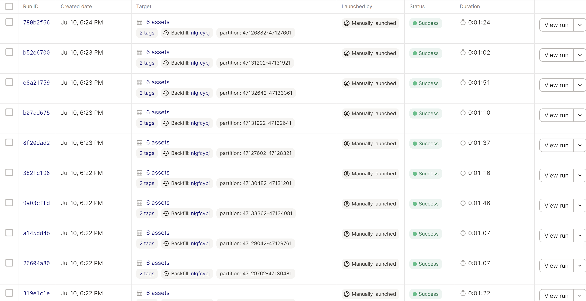
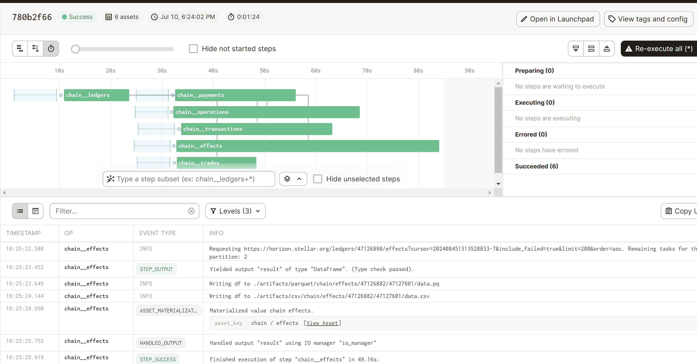

# Raw Block ETL for Stellar

### Node Providers

- Official Stellar Horizon node

### JSON-RPC API References

- https://developers.stellar.org/api/horizon
- Ledgers: https://developers.stellar.org/api/horizon/resources/ledgers/
- Transactions: https://developers.stellar.org/api/horizon/resources/transactions/
- Operations: https://developers.stellar.org/api/horizon/resources/operations/
- Effects: https://developers.stellar.org/api/horizon/resources/effects/
- Trades: https://developers.stellar.org/api/horizon/resources/trades/

### Please describe the steps you've taken to validate the data

Ran the following partitions, with limits to the number of entities requests each partition:
- First 101 partitions: Ledger 2 - 72721
- Latest 102 partitions: Ledger 47061362 - 47133362
- Checked the validity of results in csv

### Available Entities in the API not included (and why)

- These entities are not included because only their latest version is available, so a time series database is not possible:
    - Accounts: User-owned accounts in the Stellar network
    - Assets: Representations of value issued on the Stellar network
    - Claimable balances: The transfer(able) of ownership of some amount of an asset
    - Liquidity Pools: The same definition of liquidity pool we have elsewhere. There is a paging token, but it is a 64-digit hexadecimal number that has no visible patterns in its original form, its decimal form or its binary form
    - Offers: Bid/Asks on the Stellar network
    - Order books: A collection of offers for a specific pair of asset
    - Fee stats: It is an estimation of the fee to transact on the network now

- These entities are aggregations of other included entities:
    - Trade aggregations

### Other Nodes:
- Ledgers: The official Stellar Horizon node does not have record of the #1 genesis ledger, thus the starting ledger is #2.
- The pipeline may not work if partitions are ran seamlessly one after another. The horizon node rate limits operate by counting requests per hour, and although we have a 1 second delay between requests, the use of async features may cause the requests to be sent in a shorter time frame.

### Successful runs

